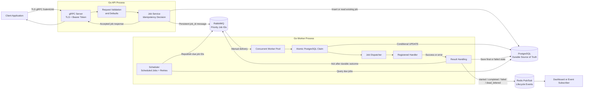

# Job Distribution Platform API Technical Documentation

**API version:** `jobs.v1`  
**Transport:** gRPC over TLS  
**Primary method:** `jobs.v1.JobService/SubmitJob`  
**Implementation language:** Go

## 1. Purpose

This document explains the API and backend architecture of the Job Distribution
Platform. It is written to stand on its own, so a reader can understand the
system without running the code or opening the repository.

The platform accepts background jobs, stores their durable state, distributes
them to concurrent workers, retries temporary failures, and publishes live
lifecycle events.

Typical job examples include:

- Sending an email
- Calling a webhook
- Processing a report
- Running a deployment or another long-running operation

The included handlers are demonstrations. The platform is the reusable part:
new handlers can be registered without changing the API, queue, scheduler, or
worker lifecycle.

## 2. Executive Summary

The API is intentionally small. It exposes one command:

```text
SubmitJob
```

A client submits a job through a TLS-protected gRPC connection. A bearer token
authenticates the caller. The API validates the request and stores the complete
job in PostgreSQL. For an immediately runnable job, it publishes only the new
job ID to RabbitMQ.

Workers consume job IDs from RabbitMQ and atomically claim the corresponding
PostgreSQL rows. This atomic claim prevents duplicate queue deliveries from
running the same job concurrently. Workers execute the matching handler, save
the result, and publish lifecycle events through Redis Pub/Sub.

PostgreSQL is the durable source of truth. RabbitMQ handles work distribution,
and Redis provides non-durable live notifications.

## 3. API Responsibilities

The API is responsible for:

- Accepting structured job submissions
- Authenticating clients
- Validating request fields
- Applying defaults
- Enforcing idempotent submission
- Persisting complete jobs in PostgreSQL
- Publishing immediately runnable job IDs to RabbitMQ
- Returning the accepted or previously existing job

The API is not responsible for:

- Executing handlers
- Polling scheduled jobs
- Running retries
- Publishing worker lifecycle events
- Providing a browser interface
- Providing an HTTP/JSON REST endpoint

Those responsibilities belong to the worker, scheduler, and event publisher.

## 4. API Contract

The protocol definition is stored in `api/jobs.proto`.

```proto
syntax = "proto3";

package jobs.v1;

import "google/protobuf/struct.proto";

service JobService {
  rpc SubmitJob(google.protobuf.Struct) returns (google.protobuf.Struct);
}
```

The current implementation uses protobuf `Struct` messages. This keeps the
first API slice small and flexible, but it provides less compile-time safety
than dedicated generated request and response message types.

### 4.1 Method

```text
/jobs.v1.JobService/SubmitJob
```

The method is unary: one request produces one response.

### 4.2 Authentication Metadata

Secure clients send one authorization value:

```text
authorization: Bearer <token>
```

The token is compared in constant time. A missing, duplicated, or incorrect
authorization value is rejected before the method handler executes.

### 4.3 Request Fields

| Field | Type | Required | Default | Validation and meaning |
| --- | --- | --- | --- | --- |
| `idempotency_key` | string | Yes | None | Non-empty and at most 200 characters. It identifies one logical submission. |
| `type` | string | Yes | None | Non-empty job-handler name, such as `email`. |
| `payload` | object | No | `{}` | Handler-specific values. Values are normalized to strings. |
| `priority` | string | No | `medium` | Must be `low`, `medium`, or `high`. |
| `max_retries` | whole number | No | `0` | Must be zero or greater. It counts retries after the first attempt. |
| `scheduled_at` | RFC3339 string | No | Immediate | Future time at which the scheduler may enqueue the job. |

The API verifies that `type` is non-empty, but it does not check whether a
handler is registered for that type. An unknown type is accepted as a job and
later fails during worker dispatch.

### 4.4 Example Request

```json
{
  "idempotency_key": "welcome-email-user-42",
  "type": "email",
  "payload": {
    "to": "user@example.com",
    "subject": "Welcome"
  },
  "priority": "high",
  "max_retries": 2,
  "scheduled_at": "2026-08-01T10:00:00Z"
}
```

### 4.5 Response Fields

| Field | Type | Meaning |
| --- | --- | --- |
| `id` | integer | PostgreSQL job ID |
| `idempotency_key` | string | Idempotency key supplied by the client |
| `type` | string | Submitted job type |
| `status` | string | Current durable job status |
| `priority` | string | Effective priority after defaults |

### 4.6 Example Response

```json
{
  "id": 42,
  "idempotency_key": "welcome-email-user-42",
  "type": "email",
  "status": "queued",
  "priority": "high"
}
```

For a new request, the usual response status is `queued`. If an idempotency key
already exists, the API returns the original job in its current state. That
state might already be `running`, `completed`, `failed`, or `dead_letter`.

## 5. Security Model

### 5.1 TLS

The normal API mode requires:

- A server TLS certificate
- The matching private key
- A bearer authentication token

The server fails closed when any secure-mode value is missing. It also refuses
to use bearer-token authentication without TLS because an unencrypted
connection could expose the token.

The included Docker Compose configuration mounts the certificate, private key,
and token as secret files. They are not written directly into `compose.yaml`,
and the complete `secrets/` directory is excluded from Docker build contexts.

### 5.2 Local Insecure Mode

`GRPC_ALLOW_INSECURE=true` exists only for isolated experiments. It is not used
by the normal Docker Compose deployment and should not be enabled on a public
or shared network.

### 5.3 Network Exposure

Docker Compose binds the gRPC endpoint to:

```text
127.0.0.1:50051
```

This makes the local API reachable from the host but not directly from another
machine. A real external deployment should use a trusted certificate, firewall
rules, and a controlled ingress or reverse proxy.

## 6. Submission Processing Flow

For a new immediately runnable job, `SubmitJob` follows these steps:

1. The client completes the TLS handshake.
2. The authentication interceptor validates the bearer token.
3. The gRPC adapter converts the protobuf `Struct` into `SubmitJobInput`.
4. Field types and values are validated.
5. The service applies the default `medium` priority and an empty payload when needed.
6. PostgreSQL attempts to insert the complete job with status `queued`.
7. The unique idempotency index decides whether this is a new logical submission.
8. For a duplicate key, the existing job is returned and no message is published.
9. For a future job, the new row is returned and the scheduler handles it later.
10. For an immediate job, RabbitMQ receives a persistent message containing only the job ID.
11. The publisher waits for RabbitMQ confirmation.
12. PostgreSQL marks the job as enqueued.
13. The API returns the accepted job.

Separating durable data from queue messages keeps RabbitMQ messages small and
prevents the database and queue from becoming competing copies of the complete
job.

## 7. PostgreSQL and Idempotency

### 7.1 Source of Truth

PostgreSQL stores:

- Job ID and idempotency key
- Job type and JSON payload
- Status and priority
- Scheduled and retry times
- Queue marker
- Retry limit and attempt count
- Last error
- Creation and update timestamps

The API and worker can restart without losing job state.

### 7.2 Idempotency Guarantee

A partial unique index protects non-empty idempotency keys:

```sql
CREATE UNIQUE INDEX jobs_idempotency_key_idx
ON jobs (idempotency_key)
WHERE idempotency_key <> '';
```

Creation uses `INSERT ... ON CONFLICT DO NOTHING`. When the key already exists,
the repository reads and returns the original row.

This protects clients from accidental duplicate submissions caused by retries,
timeouts, or repeated button clicks.

The key is global to the platform, not scoped by client or job type. A client
must therefore use a new stable key for each logical operation. Reusing a key
with different payload data returns the original job; the API does not replace
or compare the original payload.

### 7.3 Atomic Worker Claim

Workers claim jobs with one conditional PostgreSQL update:

```sql
UPDATE jobs
SET status = 'running',
    attempts = attempts + 1
WHERE id = $1
  AND status IN ('queued', 'failed')
RETURNING ...;
```

Only one concurrent worker can successfully change the eligible row and
receive it back. Other workers treat the message as already claimed or
finished and acknowledge it without executing the handler.

The real query also allows a redelivered RabbitMQ message to reclaim a
`running` job after the previous consumer connection is lost.

## 8. RabbitMQ Delivery and Worker Execution

RabbitMQ receives a compact message:

```json
{
  "job_id": 42
}
```

Queue behavior includes:

- Durable queue declaration
- Persistent messages
- Priorities mapped as `high=3`, `medium=2`, and `low=1`
- Publisher confirms
- Consumer prefetch of three messages
- Manual acknowledgement
- Negative acknowledgement with requeue on infrastructure errors

The worker acknowledges a delivery only after the corresponding job has
reached a durable outcome for that attempt.

Worker processing is:

1. Read a job ID from RabbitMQ.
2. Atomically claim the PostgreSQL job.
3. Acquire the configured per-job-type concurrency slot.
4. Publish `job.started`.
5. Resolve the handler through the dispatcher.
6. Execute the handler.
7. Save `completed`, `failed`, or `dead_letter`.
8. Publish the corresponding Redis event.
9. Acknowledge the RabbitMQ delivery.

The default worker process starts three worker goroutines. The sample
`deployment` type has a process-local concurrency limit of one.

## 9. Delivery Semantics

RabbitMQ provides at-least-once delivery, not exactly-once delivery.

The PostgreSQL claim prevents ordinary duplicate queue messages from executing
the same job concurrently. However, a real handler can still repeat an
external side effect in this failure window:

1. The handler successfully calls an external system.
2. The worker crashes before saving the final status or acknowledging RabbitMQ.
3. RabbitMQ redelivers the message.
4. Another worker reclaims and runs the job.

Real handlers that charge money, send messages, or change third-party systems
should pass the job ID or another idempotency key to those external systems.

## 10. Scheduling, Retries, and Dead Letters

### 10.1 Scheduled Jobs

A future job remains in PostgreSQL with:

```text
status = queued
enqueued = false
```

The scheduler checks for due jobs every 500 milliseconds and publishes their
IDs to RabbitMQ.

### 10.2 Failed Attempts

A failed handler with retries remaining is stored as:

```text
status = failed
next_retry_at = calculated future time
enqueued = false
```

The scheduler republishes it after `next_retry_at`.

### 10.3 Exponential Backoff

Retry delays begin at one second and approximately double:

```text
1s, 2s, 4s, 8s, 16s, 30s
```

Positive random jitter of up to 25 percent is added below the 30-second cap.
Jitter reduces the chance that many failed jobs retry simultaneously.

`max_retries` counts retries after the first attempt. For example,
`max_retries=2` permits at most three total attempts.

### 10.4 Dead-Letter State

When no retry remains, the job moves to:

```text
dead_letter
```

The current system records this state in PostgreSQL rather than moving the
message to a separate RabbitMQ dead-letter queue.

## 11. Redis Lifecycle Events

Workers publish these event names:

- `job.started`
- `job.completed`
- `job.failed`
- `job.dead_lettered`

Example event:

```json
{
  "name": "job.completed",
  "job_id": 42,
  "type": "email",
  "status": "completed",
  "attempts": 1,
  "occurred_at": "2026-08-01T10:00:02Z"
}
```

The default channel is:

```text
job.events
```

Redis Pub/Sub is intentionally non-durable. An offline subscriber misses
events, while PostgreSQL still retains the authoritative job state.

## 12. Error Behavior

| Situation | Result |
| --- | --- |
| Missing or incorrect bearer token | gRPC `Unauthenticated` |
| Missing required request field | gRPC `InvalidArgument` |
| Invalid priority | gRPC `InvalidArgument` |
| Payload is not an object | gRPC `InvalidArgument` |
| Retry count is negative or not a whole number | gRPC `InvalidArgument` |
| Invalid RFC3339 schedule string | gRPC `InvalidArgument` |
| PostgreSQL, RabbitMQ, or service failure | gRPC `Internal` |
| TLS certificate verification failure | Connection or TLS handshake failure |

The current API maps all service-layer errors to `Internal`. A future version
could introduce more precise status mapping for conflicts, unavailable
dependencies, and validation that currently occurs inside the service.

## 13. Configuration

| Variable | API purpose |
| --- | --- |
| `APP_MODE=api` | Starts the gRPC API process |
| `GRPC_ADDRESS` | Listen address, default `:50051` |
| `GRPC_TLS_CERT_FILE` | Server certificate path |
| `GRPC_TLS_KEY_FILE` | Server private-key path |
| `GRPC_AUTH_TOKEN` or `GRPC_AUTH_TOKEN_FILE` | Bearer token value |
| `GRPC_ALLOW_INSECURE` | Explicit local-only insecure opt-in |
| `DATABASE_URL` or `DATABASE_URL_FILE` | PostgreSQL connection |
| `RABBITMQ_URL` or `RABBITMQ_URL_FILE` | RabbitMQ connection |
| `JOB_QUEUE_NAME` | Queue name, default `jobs` |

When a `_FILE` variable is present, its trimmed file contents take precedence
over the direct environment variable.

## 14. Local API Demonstration

Generate local secrets from PowerShell:

```powershell
./scripts/generate-local-secrets.ps1
```

From Git Bash, invoke the PowerShell script explicitly:

```bash
powershell.exe -ExecutionPolicy Bypass -File ./scripts/generate-local-secrets.ps1
```

Start the dependencies, worker, and API:

```powershell
docker compose up -d --build postgres rabbitmq redis worker api
```

Submit a TLS-authenticated sample request:

```powershell
docker compose --profile tools run --rm grpc-client
```

Use a stable key to demonstrate duplicate protection:

```powershell
docker compose --profile tools run --rm -e IDEMPOTENCY_KEY=demo-request-1 grpc-client
docker compose --profile tools run --rm -e IDEMPOTENCY_KEY=demo-request-1 grpc-client
```

Both calls should report the same job ID.

Watch worker execution:

```powershell
docker compose logs -f worker
```

Watch live Redis events before submitting:

```powershell
docker compose exec redis redis-cli SUBSCRIBE job.events
```

Inspect durable state:

```powershell
docker compose exec postgres psql -U jobs -d jobs -c "SELECT id, idempotency_key, type, status, attempts FROM jobs ORDER BY id;"
```

## 15. Verification Strategy

The repository includes automated coverage for:

- gRPC request conversion
- Bearer-token acceptance and rejection
- Idempotent service submission
- Repository behavior
- Priority queue behavior
- Worker completion, retry, and dead-letter behavior

Run:

```powershell
go test ./...
go test -race ./...
go vet ./...
```

The distributed flow has also been exercised through Docker Compose with a
real PostgreSQL database, RabbitMQ broker, Redis server, API container, worker
container, and TLS-authenticated client.

## 16. Code Responsibility Map

| File | Responsibility |
| --- | --- |
| `api/jobs.proto` | Public gRPC service declaration |
| `internal/jobs/grpc.go` | TLS server/client, authentication, request conversion, response conversion |
| `internal/jobs/service.go` | Submission rules, defaults, idempotency flow, scheduling decision |
| `internal/jobs/postgres.go` | Durable schema, idempotent insert, atomic claim, due-job queries |
| `internal/jobs/rabbitmq.go` | Priority queue, persistence, confirms, acknowledgements |
| `internal/jobs/worker.go` | Claims, concurrency control, handler execution, retry decisions |
| `internal/jobs/scheduler.go` | Scheduled-job and retry polling |
| `internal/jobs/events.go` | Redis lifecycle event publishing |
| `internal/jobs/dispatcher.go` | Job-type to handler routing |
| `main.go` | Runtime modes and dependency construction |
| `compose.yaml` | Local distributed deployment and secret mounts |

## 17. Current API Boundaries

The current API is a deliberate first version. It does not yet include:

- Get-job, list-jobs, cancel-job, or retry-job RPCs
- Dedicated generated protobuf request and response types
- gRPC reflection
- Role-based authorization or multiple API clients
- Token rotation
- Request rate limiting
- Metrics and distributed tracing
- Automatic RabbitMQ reconnection
- A managed migration tool
- An HTTP/JSON gateway

These are reasonable extensions if the project moves from a portfolio-grade
distributed backend into a multi-user production service.

An ordered implementation and learning plan for these extensions is available
in the [observability and production roadmap](README.md).

## 18. Architecture Diagram

The diagram below is Mermaid syntax. GitHub renders it as a visual diagram, and
it can be exported to SVG or PNG for a resume, LinkedIn document, or portfolio.


