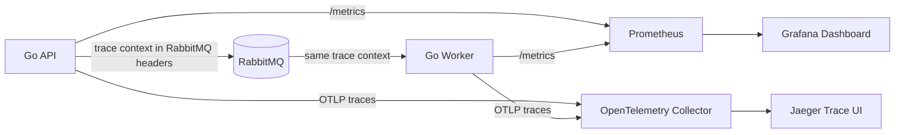

# Next Steps: Observability and Production Roadmap

This guide explains how to continue the Job Distribution Platform without
turning it into an overengineered project.

Read this file before starting the next implementation phase. Complete one
phase, test it, and commit it before moving to the next phase.

The immediate goal is observability:

1. Prometheus metrics
2. OpenTelemetry traces
3. Simple dashboards and trace inspection

The remaining API and production features come later.

For the next coding phase, read only Sections 1 through 5 and Section 15.
Ignore the later API phases until Prometheus metrics and OpenTelemetry traces
are working and understandable.

## 1. Recommended Order

| Phase | Outcome | Priority | Difficulty |
| --- | --- | --- | --- |
| 0 | Preserve the current working baseline | Required | Easy |
| 1 | Prometheus metrics and health endpoints | Build next | Medium |
| 2 | OpenTelemetry distributed traces | Build after metrics | Medium |
| 3 | Structured logs with trace IDs | Useful after tracing | Easy |
| 4 | Generated protobuf types and reflection | Strong API improvement | Medium |
| 5 | Managed PostgreSQL migrations | Before schema growth | Medium |
| 6 | Get-job and list-jobs RPCs | Useful API feature | Medium |
| 7 | Cancel-job and retry-job RPCs | Optional control feature | Advanced |
| 8 | Automatic RabbitMQ reconnection | Reliability improvement | Advanced |
| 9 | Multiple clients, RBAC, token rotation, and rate limits | Multi-user only | Advanced |
| 10 | HTTP/JSON gateway | Optional compatibility | Medium |

Do not implement every row in one branch. The first two observability phases
already make the project substantially stronger.

## 2. Monitoring Mental Model

Observability has three main signals:

| Signal | Question it answers | Tool in this roadmap |
| --- | --- | --- |
| Metrics | Is the system healthy, fast, or failing more often? | Prometheus |
| Traces | Where did one request spend time across services? | OpenTelemetry and Jaeger |
| Logs | What exact event or error occurred? | Go `log/slog` |

The tools have different responsibilities:

- Prometheus scrapes and stores numeric time-series metrics.
- OpenTelemetry instruments code and exports traces.
- The OpenTelemetry Collector receives and forwards telemetry.
- Jaeger displays distributed traces.
- Grafana can display Prometheus dashboards later.

OpenTelemetry is not itself a dashboard or long-term database.

### Recommended Simple Architecture



### Important Design Choice

Use the official Prometheus Go client directly for metrics. Use OpenTelemetry
for traces.

This is the simplest learning path:

- Prometheus metrics are stable and easy to inspect through `/metrics`.
- OpenTelemetry traces are stable and teach distributed context propagation.
- The OpenTelemetry Prometheus exporter is still less mature than the direct
  Prometheus client.
- OpenTelemetry logs should wait until its Go logging signal is fully mature.

## 3. Phase 0: Protect the Working Baseline

Before every phase:

```powershell
go test ./...
go test -race ./...
go vet ./...
docker compose config --quiet
```

Create one branch or commit for one concept. Examples:

```text
observability/prometheus-metrics
observability/otel-tracing
api/generated-protobuf
reliability/rabbitmq-reconnect
```

Do not mix API methods, migrations, monitoring, and authentication in one
change. Small commits make the code easier to understand and debug.

## 4. Phase 1: Prometheus Metrics

Start here.

### What You Will Learn

- Counter, gauge, and histogram metric types
- How Prometheus scrapes a Go process
- How to select useful measurements
- Why metric label cardinality matters
- How to monitor the API and worker separately

### Suggested Files

```text
internal/observability/metrics.go
internal/observability/server.go
observability/prometheus.yml
```

`metrics.go` should own the registered metric collectors. `server.go` should
start a small HTTP server exposing `/metrics` and `/healthz`.

The API and worker run in separate containers, so both can listen on internal
port `2112`. Prometheus can scrape:

```text
api:2112
worker:2112
```

The metrics ports do not need to be exposed publicly.

### Health Checks Are Separate

A health check answers whether a process can serve work now. A metric describes
behavior over time.

- Register the standard gRPC health service for the API.
- Use `/healthz` for the worker and metrics HTTP server.
- Mark the API as not serving during graceful shutdown.
- Keep the first worker health check simple: initialization succeeded and the
  process is running.

Do not treat a successful `/metrics` response as proof that job processing is
healthy.

### First Metrics

| Metric | Type | Labels | Meaning |
| --- | --- | --- | --- |
| `job_submissions_total` | Counter | `result`, `priority` | Accepted, duplicate, or failed submissions |
| `job_submission_duration_seconds` | Histogram | `result` | Time spent accepting a job |
| `job_attempts_total` | Counter | `type`, `outcome` | Worker attempt results |
| `job_processing_duration_seconds` | Histogram | `type`, `outcome` | Handler execution time |
| `job_retries_scheduled_total` | Counter | `type` | Retries scheduled |
| `job_dead_letter_total` | Counter | `type` | Jobs that exhausted retries |
| `job_active` | Gauge | `type` | Jobs active in this worker process |
| `scheduler_enqueues_total` | Counter | `reason` | Scheduled jobs and retries re-enqueued |

Register the standard Go runtime and process collectors too. They expose useful
information such as goroutine count, memory use, garbage collection, and CPU
time.

### Cardinality Rule

Never use these as Prometheus labels:

- `job_id`
- `idempotency_key`
- Email address
- Payload values
- Error messages
- Trace IDs

Those values can create an unbounded number of time series and consume large
amounts of memory.

Keep `type` bounded to registered job types. Normalize unknown types to
`unknown` before using them as a metric label.

### Where to Record Metrics

- `Service.SubmitJob`: submission count and duration
- `Worker.process`: attempt count, duration, and active gauge
- `Worker.handleFailedJob`: retries and dead letters
- `Scheduler.EnqueueDueJobs`: scheduler enqueue count
- RabbitMQ connection code: connection failures and reconnects later

Do not place Prometheus calls throughout every function. Pass one small metrics
object into the service, worker, and scheduler.

### Prometheus Compose Service

Add Prometheus under an `observability` Compose profile. Mount
`observability/prometheus.yml` and expose its UI only on localhost:

```text
127.0.0.1:9090
```

Start it with:

```powershell
docker compose --profile observability up -d prometheus
```

### Definition of Done

- `api:2112/metrics` is scrapeable inside Compose.
- `worker:2112/metrics` is scrapeable inside Compose.
- Prometheus reports both targets as `UP`.
- Submitting a job increments `job_submissions_total`.
- Completing a job updates worker counters and histograms.
- Tests use a fresh Prometheus registry and do not share global state.
- Metrics never contain payloads, credentials, or unbounded IDs.

## 5. Phase 2: OpenTelemetry Tracing

Add tracing only after metrics work.

### What You Will Learn

- Traces, spans, trace IDs, and parent-child relationships
- Automatic gRPC instrumentation
- Manual application spans
- OTLP exporting
- Context propagation through RabbitMQ
- Graceful telemetry shutdown

### Suggested Files

```text
internal/observability/tracing.go
observability/otel-collector.yaml
```

`tracing.go` should initialize one tracer provider and return a shutdown
function. `main.go` should call that shutdown function before the process exits.

Give each runtime mode a service name:

```text
job-api
job-worker
job-producer
```

### Start With Console Traces

First export spans to standard output. This lets you learn span structure
without Docker configuration.

After the spans look correct, switch to OTLP and send them to the OpenTelemetry
Collector.

### Instrument gRPC

Use the OpenTelemetry gRPC stats handlers:

```text
grpc.StatsHandler(otelgrpc.NewServerHandler())
grpc.WithStatsHandler(otelgrpc.NewClientHandler())
```

Keep the existing authentication interceptor. Tracing and authentication solve
different problems and should both remain enabled.

### Manual Spans

| Span | Location | Useful attributes |
| --- | --- | --- |
| `job.submit` | `Service.SubmitJob` | type, priority, duplicate |
| `job.enqueue` | RabbitMQ publish | queue, priority |
| `job.process` | `Worker.process` | type, attempt, redelivered |
| `job.handler` | Dispatcher or handler call | type, outcome |
| `job.retry.schedule` | Failed-job handling | type, attempt |
| `scheduler.enqueue_due` | Scheduler | reason, count |

Job IDs are acceptable trace attributes because traces are sampled events, but
payloads, authentication tokens, and personal data still must not be recorded.

### RabbitMQ Trace Propagation

The gRPC request and worker execution happen in different processes. They will
appear as unrelated traces unless trace context travels with the message.

Keep the message body small:

```json
{"job_id": 42}
```

Inject W3C trace context into RabbitMQ message headers:

```text
traceparent
tracestate
```

On consumption:

1. Extract the context from the AMQP headers.
2. Store it on `JobDelivery` or pass it directly to worker processing.
3. Start the worker span using the extracted context.

Do not store trace context permanently in the job payload.

### Collector and Trace Viewer

Add these services under the `observability` Compose profile:

```text
otel-collector
jaeger
```

Use OTLP gRPC on internal port `4317`. Expose only the Jaeger UI to localhost,
normally on port `16686`.

### Definition of Done

- One gRPC submission creates a server span.
- PostgreSQL and RabbitMQ work appears under the submission trace.
- Worker processing uses the propagated trace context.
- API and worker spans share the same trace ID.
- Failed jobs record an error status without storing sensitive payloads.
- The tracer provider flushes spans during graceful shutdown.
- Jaeger displays the complete API-to-worker path.

## 6. Phase 3: Structured Logs

After tracing works, replace plain log messages gradually with Go `log/slog`.

Use consistent fields:

```text
service
job_id
job_type
status
attempt
worker_id
trace_id
span_id
```

Do not rewrite every log statement at once. Start with API submission, worker
start/completion, retries, dead letters, and connection failures.

Keep logs on standard output so Docker can collect them. Do not add an
OpenTelemetry log exporter yet; OpenTelemetry Go logs are less mature than
traces and metrics.

## 7. Phase 4: Generated Protobuf Types and Reflection

Do this before adding many new RPCs.

### Replace Dynamic Structs

Define dedicated messages in `api/jobs.proto`:

```text
SubmitJobRequest
SubmitJobResponse
Job
JobPriority
JobStatus
```

Use:

- `map<string, string>` for payload
- Protobuf enums for priority and status
- `google.protobuf.Timestamp` for schedule times

Generate Go server and client code. Generated files must not be edited by hand.
Keep generation reproducible with a documented command or Go tool dependency.

### Add Reflection

Reflection lets tools such as `grpcurl` and Postman discover the API contract.
Enable it for local development first. Decide separately whether a public
production endpoint should expose reflection.

### Definition of Done

- No manual `grpc.ServiceDesc` is required.
- No response uses unsafe `map[string]any` type assertions.
- Invalid field types fail during protobuf decoding or validation.
- The included client uses generated code.
- `grpcurl list` can discover the local API.

## 8. Phase 5: Managed PostgreSQL Migrations

Add migrations before introducing new statuses, clients, roles, or tokens.

Use a small migration tool such as Goose and create:

```text
migrations/
  00001_initial_jobs.sql
```

Move table and index creation out of application startup. Run migrations as a
separate command or one-shot Compose service before starting API and worker
replicas.

Do not let every API and worker replica perform production schema changes.

### Definition of Done

- A fresh database can be created entirely from migration files.
- Migration versions are tracked in PostgreSQL.
- Applying migrations twice is safe.
- The API and worker only verify/connect to the expected schema.
- Upgrade and rollback behavior is documented.

## 9. Phase 6: Get-Job and List-Jobs RPCs

Add read operations before cancellation or manual retry:

```text
GetJob(id)
ListJobs(status, type, page_size, page_token)
```

Start with:

- Get by numeric ID
- List with a fixed maximum page size
- Filters for status and type
- Stable ordering by ID
- Pagination

Do not return every database row without a limit.

Useful status mapping:

- Missing job: `NotFound`
- Invalid page size or token: `InvalidArgument`
- Database unavailable: `Unavailable` or `Internal`

Prometheus metrics and traces should automatically cover these new methods.

## 10. Phase 7: Cancel-Job and Retry-Job RPCs

These operations require clear state-transition rules.

### Cancel

Start with queued and failed jobs only:

```text
queued -> cancelled
failed -> cancelled
```

Add `cancelled` through a migration. A RabbitMQ message might still exist, so
the worker must detect the cancelled PostgreSQL state and acknowledge the
message without running the handler.

Cancelling an already running external operation is much harder. Do not promise
it until cancellation context can reach the actual handler across replicas.

### Manual Retry

Allow only:

```text
dead_letter -> queued
failed -> queued
```

Decide and document whether manual retry resets the attempt count. Use a
conditional PostgreSQL update so two operators cannot retry the same job
simultaneously.

## 11. Phase 8: Automatic RabbitMQ Reconnection

This is the most important remaining reliability improvement.

The current queue owns one connection, publish channel, consume channel, and
consumer initialized through `sync.Once`. A closed broker connection therefore
requires an application restart.

The reconnect design must:

1. Detect connection and channel closure.
2. Retry dialing with capped exponential backoff and jitter.
3. Recreate publish and consume channels.
4. Redeclare the durable priority queue.
5. Re-enable publisher confirms and consumer QoS.
6. Restart consumption without duplicating local consumer loops.
7. Stop cleanly when the application context is cancelled.
8. Expose reconnect count and connection state through metrics.

The current RabbitMQ Go client version in this project predates its experimental
automatic recovery support. When implementing this phase, choose one approach:

- Build an explicit reconnect supervisor for learning and full control.
- Upgrade the client and carefully evaluate its experimental recovery feature.

Do not combine both approaches.

### Required Integration Test

1. Start the complete Compose stack.
2. Submit and complete a job.
3. Restart RabbitMQ without restarting API or worker.
4. Wait for automatic reconnection.
5. Submit another job.
6. Confirm it completes once.

## 12. Phase 9: Multiple Clients and Authorization

The current single bearer token is enough for a private demonstration.

Only build this phase when the API has multiple real callers.

Recommended progression:

1. Identify clients with separate high-entropy tokens.
2. Store only token hashes.
3. Put a client identity into request context.
4. Add simple roles such as `submitter`, `viewer`, and `operator`.
5. Map each gRPC method to required permissions.
6. Support overlapping old/new tokens during rotation.
7. Record authentication failures without logging tokens.

Add rate limiting after client identity exists:

- One API replica: in-memory token bucket per client
- Multiple API replicas: shared Redis-backed limits

Return gRPC `ResourceExhausted` when a client exceeds its limit.

## 13. Phase 10: HTTP/JSON Gateway

Build this only if browsers, simple scripts, or non-gRPC clients need access.

Use gRPC-Gateway after generated protobuf messages exist. Keep gRPC as the
source API contract and generate the HTTP reverse proxy from protobuf
annotations.

Possible routes:

```text
POST /v1/jobs
GET  /v1/jobs/{id}
GET  /v1/jobs
POST /v1/jobs/{id}:cancel
POST /v1/jobs/{id}:retry
```

Do not maintain separate handwritten REST and gRPC business logic. Both
transports should call the same service layer.

## 14. Features to Delay

Do not add these merely to make the technology list longer:

- Kubernetes
- Multiple RabbitMQ nodes
- Distributed per-type concurrency limits
- A separate dead-letter RabbitMQ exchange
- OpenTelemetry log export
- Complex RBAC policy engines
- A service mesh
- Multiple trace backends

Add them only when a concrete requirement appears.

## 15. Your First Observability Coding Session

Follow this order when you start:

1. Add the official Prometheus Go client dependency.
2. Create a private Prometheus registry.
3. Register Go runtime and process collectors.
4. Start an internal `/metrics` server.
5. Add submission and worker attempt counters.
6. Add one worker duration histogram.
7. Add Prometheus to the Compose observability profile.
8. Submit one job and inspect the changed metrics.
9. Add tests before introducing more metrics.

Stop after this session. Review the code and make sure you understand every
collector before starting OpenTelemetry.

## 16. Questions You Should Be Able to Answer

After Prometheus:

- Why is a counter different from a gauge?
- Why are processing times histograms?
- Why must job IDs not be metric labels?
- Why does each process expose its own metrics?

After OpenTelemetry:

- What is the difference between a trace and a span?
- Why must trace context travel through RabbitMQ headers?
- Why does the tracer provider need graceful shutdown?
- Why can one job have spans from both API and worker processes?

After the later API phases:

- Why are generated protobuf messages safer than `Struct`?
- Why does cancellation require a database state transition?
- Why must migrations run separately from every application replica?
- Why does reconnecting require channel and consumer recreation?

If you can answer these questions, the new code is teaching you useful backend
engineering rather than only adding dependencies.

## 17. Official Learning References

- [OpenTelemetry Go](https://opentelemetry.io/docs/languages/go/)
- [OpenTelemetry Go getting started](https://opentelemetry.io/docs/languages/go/getting-started/)
- [OpenTelemetry exporters](https://opentelemetry.io/docs/languages/go/exporters/)
- [OpenTelemetry Collector quick start](https://opentelemetry.io/docs/collector/quick-start/)
- [OpenTelemetry messaging spans](https://opentelemetry.io/docs/specs/semconv/messaging/messaging-spans/)
- [OpenTelemetry gRPC instrumentation for Go](https://pkg.go.dev/go.opentelemetry.io/contrib/instrumentation/google.golang.org/grpc/otelgrpc)
- [Prometheus Go application guide](https://prometheus.io/docs/guides/go-application/)
- [gRPC reflection](https://grpc.io/docs/guides/reflection/)
- [gRPC health checking](https://grpc.io/docs/guides/health-checking/)
- [gRPC-Gateway](https://github.com/grpc-ecosystem/grpc-gateway)
- [RabbitMQ Go client documentation](https://pkg.go.dev/github.com/rabbitmq/amqp091-go)
- [Goose migrations](https://pressly.github.io/goose/)
